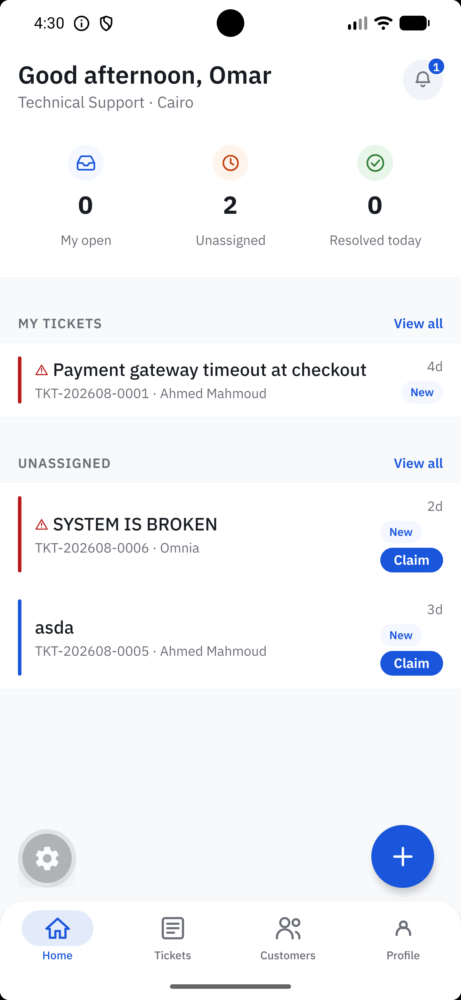
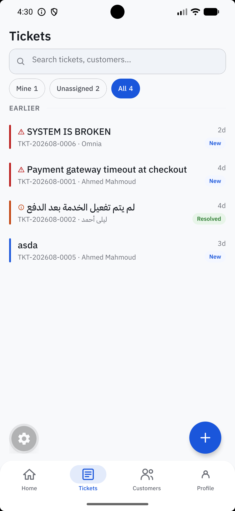
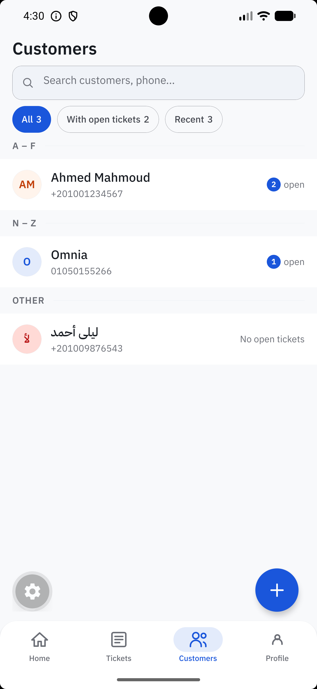
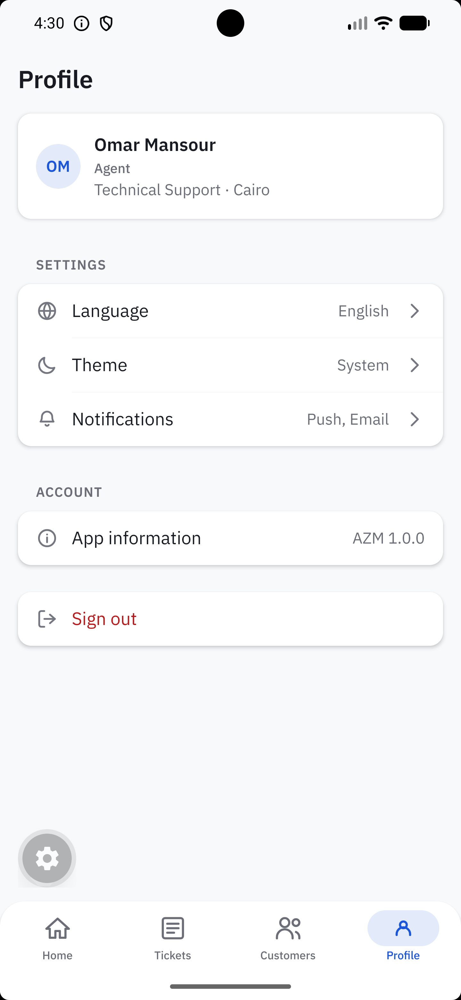
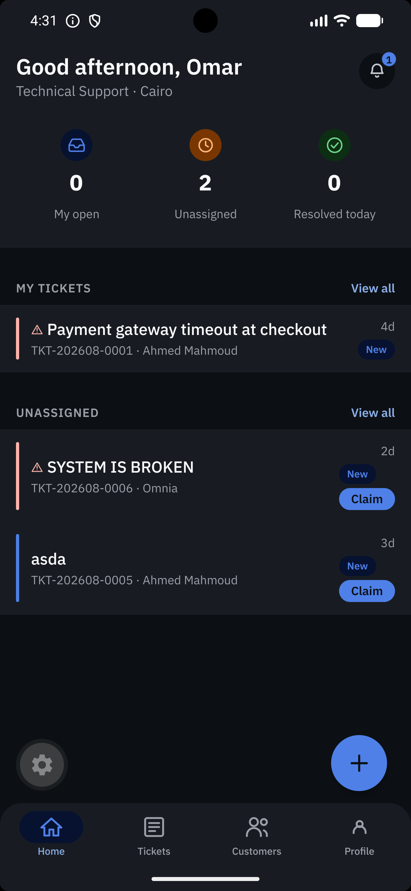
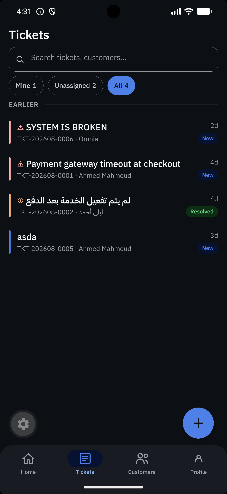
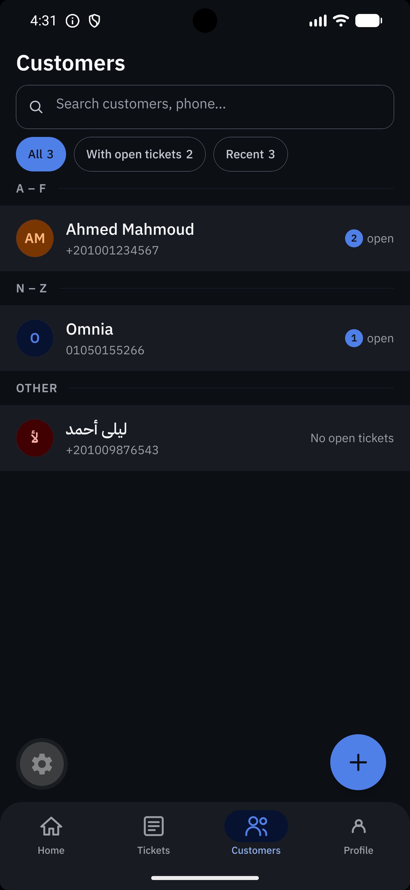
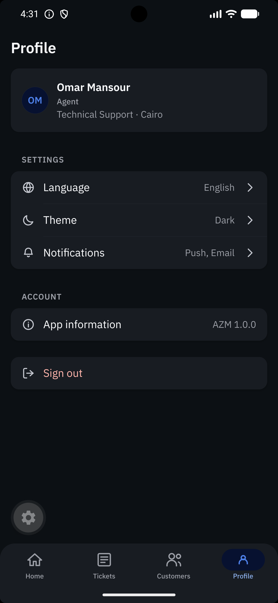

# AZM CRM

A customer-support CRM for support agents on phones and tablets. Agents sign in, create customers,
open tickets, work them through a lifecycle (assign, reply, add internal notes, change status) and
resolve them. Arabic-first with English support, light and dark themes, RTL by construction.

Built with **Expo 57 · React Native 0.86 · Expo Router · TypeScript (strict) · TanStack Query ·
Supabase · i18next · React Hook Form**.

Design: [AZM – CRM on Figma](https://www.figma.com/design/mdfP8RPdkUsKcJb0wFdkME/AZM---CRM?node-id=0-1)
· Tracker: Jira project `azm-crm`

---

## Project context

This is a solo project built as part of a full-stack development program at AZM. It is an
assessment of the ability to plan, build and verify a complete system, not production software
with live users. That framing drives what "good" means here:

- **Correctness over speed.** The ticket state machine is enforced in the database, not only in
  the client. Row Level Security is verified with real agent JWTs rather than assumed, and the
  paths not yet verified are recorded in `docs/phase1_known_issues.md` instead of being hidden.
- **Scope is phased on purpose.** Phase 1 is the agent-facing app described below. Later phases
  (push delivery, CSAT, ticket attachments) are tracked but deliberately not pulled forward.
- **Every decision is documented.** `docs/` holds the requirements, roadmap, backend plan and
  known issues; `.squad/plans/` holds a plan for each story; `CLAUDE.md` records the live
  architectural status. If the code and a document disagree, the document is fixed in the same
  change.

AI tooling (Claude Code with the Jira and Figma MCP servers) is used throughout as a pair, and
the process for doing so is itself part of what the project demonstrates. See
[How the project came together](#how-the-project-came-together).

---

## Contents

- [Project context](#project-context)
- [What's built](#whats-built)
- [Getting started](#getting-started)
- [Commands](#commands)
- [Architecture](#architecture)
- [Backend (Supabase)](#backend-supabase)
- [Hard rules](#hard-rules)
- [State management](#state-management)
- [RTL, locale, theme, fonts](#rtl-locale-theme-fonts)
- [How the project came together](#how-the-project-came-together)
- [How this project is built (workflow)](#how-this-project-is-built-workflow)
- [Claude Code tooling](#claude-code-tooling)
- [Documentation map](#documentation-map)

---

## What's built

All six phase-1 feature folders exist and boot. The four-tab shell (Home, Tickets, Customers,
Profile) is fully real.

| Feature | Screens / behaviour | Plan |
|---|---|---|
| `auth` | Login, forgot-password, Supabase session context, `Stack.Protected` route guard, involuntary sign-out clears the query cache | `.squad/plans/auth/` (02, 18) |
| `home` | Workload summary (three counts), My tickets + Unassigned previews with inline claim, notification bell with unread badge, FAB → new ticket | `.squad/plans/home/` (03, 15, 19, 20) |
| `tickets` | Filterable, searchable, day-grouped list; ticket detail with Conversation / Internal notes / History segments and a composer; Assign sheet (compare-and-set reassignment, unassign); Status sheet driven by `state-machine.ts` with a required resolution note; create-ticket modal with customer picker, category select and priority chips; inline create-customer sheet | `.squad/plans/tickets/` (04, 07, 08, 09, 13, 16, 17, 21, 22) |
| `customers` | Paginated, alphabetically grouped list with search and open-ticket counts; customer profile with Info / Tickets / Notes tabs; create and edit modals over one shared `CustomerForm`; notes with attachments (camera / gallery / file, 10 MB + MIME allowlist, signed-URL image viewer) | `.squad/plans/customers/` (05, 10, 11, 12, 14, 24) |
| `profile` | Identity card, language / theme / notification pickers, app info, confirmed sign-out | `.squad/plans/profile/` (06) |
| `notifications` | Pushed `/notifications` route, Today / Earlier grouping, five alert types in one row component, mark-one / mark-all read | `.squad/plans/notifications/` (23) |

Cross-cutting foundation work (localisation + RTL, theming with a WCAG AA contrast gate) lives in
`.squad/plans/foundation/` (25, 26). The design-system token layer and the sixteen generic
`core/components/` came from `.squad/plans/design-system/01-...md`, a traceable reflection of the
Figma file `mdfP8RPdkUsKcJb0wFdkME`.

### Screenshots

Taken from an Android emulator running against the live Supabase project, signed in as the seed
agent Omar (Technical Support, Cairo). The same four tabs in the light and dark themes; every
colour in both rows comes from the token layer, and every pair passes the `npm run contrast` gate.

<table>
  <tr>
    <th>Home</th><th>Tickets</th><th>Customers</th><th>Profile</th>
  </tr>
  <tr>
    <td></td>
    <td></td>
    <td></td>
    <td></td>
  </tr>
  <tr>
    <td></td>
    <td></td>
    <td></td>
    <td></td>
  </tr>
</table>

Arabic (RTL) captures of the same screens are still to be added.

---

## Getting started

### Prerequisites

- Node.js (LTS) and npm
- A Supabase project (URL + anon/publishable key)
- Expo Go on a device, or an Android emulator / iOS simulator
- For `npm run gen:types`: a Supabase CLI login (`npx supabase login`)

### Install and run

```bash
npm install
cp .env.example .env      # then fill in the two values below
npm start                 # Metro; press a (Android), i (iOS) or w (web)
```

`.env` needs exactly two keys. Both are embedded in the app bundle, so only ever put the
publishable/anon key here, never a service-role key:

```
EXPO_PUBLIC_SUPABASE_URL=https://<project-ref>.supabase.co
EXPO_PUBLIC_SUPABASE_ANON_KEY=<publishable-or-anon-key>
```

See `docs/expo-guide.md` for how Expo env vars work and `docs/supabase.md` for the client setup.

### Expo Go vs development build

Everything runs in Expo Go **except** `expo-updates`, which powers the runtime reload after a
direction-changing language switch. In Expo Go (`__DEV__`) the app falls back to
`DevSettings.reload()`, so the language switch still works. The dark splash frame also only
appears in a native build. No other dependency requires a development build.

---

## Commands

```bash
npm start            # expo start
npm run android      # expo start --android
npm run ios          # expo start --ios
npm run web          # expo start --web

npm run lint         # eslint .              — real gate, enforces hard rules 2–5
npm run lint:fix
npm run typecheck    # tsc --noEmit          — real gate
npm run contrast     # WCAG AA audit over every token pair the components render — real gate
npm run format       # prettier --write "src/**/*.{ts,tsx,json}"

npm run gen:types    # regenerate src/core/types/database.ts from Supabase (needs CLI login)
```

**Verification order: `lint → typecheck → contrast → manual run`.**

There is **no test runner** yet. No Jest, no test files. The three gates plus manually exercising
the app on a device against live Supabase are the whole safety net. Every bug found so far sat on
the far side of a clean lint/typecheck run.

`contrast` compiles `scripts/contrast-audit.ts` with the installed `typescript` and runs it on
plain Node. It exits `1` if any rendered token pair falls below 4.5 (text) or 3.0 (UI) in either
theme. Its two figure/ground warnings are expected and open with design; a third means something
new collided.

---

## Architecture

Three top-level concepts under `src/`: **routes, core, features**.

```
src/
├── app/            Expo Router routes ONLY — a route file imports a screen from a
│   │               feature barrel and renders it. Nothing else.
│   ├── _layout.tsx           awaits bootstrap(), mounts providers, Stack.Protected guard
│   ├── (auth)/               login, forgot-password
│   ├── (tabs)/               index (Home), tickets, customers, profile
│   ├── tickets/              [id], new (modal)
│   ├── customers/            [id], new (modal), edit/[id] (modal)
│   └── notifications.tsx
├── core/           infrastructure and domain-free code
│   ├── components/   Text, TextInput, Icon primitives; Button, TextField, SearchField,
│   │                 TabBar, SectionHeader, BottomSheet, FilterChip, Dropzone, Avatar,
│   │                 FAB, EmptyState, ErrorState, Skeleton, OfflineBanner, …
│   ├── hooks/        useBreakpoint, useDebounce
│   ├── lib/          supabase.ts, query-client.ts, theme/, i18n/
│   ├── utils/        format.ts, errors.ts
│   └── types/        database.ts (GENERATED — never hand-edit)
└── features/       one folder per business domain
    ├── auth/  home/  tickets/  customers/  profile/  notifications/
```

Every feature has the same anatomy, and `index.ts` is its **only** import surface:

```
features/<feature>/
├── api.ts               Supabase queries and mutations
├── hooks.ts             TanStack Query hooks wrapping api.ts
├── session-context.tsx  only if the feature owns React Context (auth does)
├── types.ts
├── components/          domain components (TicketRow, StatusBadge, CustomerRow, …)
├── screens/
└── index.ts             barrel
```

Path aliases: `@/core/*` and `@/features/*`.

Authenticated non-tab routes (`tickets/[id]`, `customers/[id]`, the modals) are siblings of
`(tabs)` inside the same `Stack.Protected`. Registering a screen outside the guard leaks it to a
signed-out deep link. `typedRoutes` is on, so navigate with the object form:
`router.push({ pathname: '/customers/[id]', params: { id } })`.

A fuller narrative lives in `docs/architecture.md`.

---

## Backend (Supabase)

The backend is a single Supabase project (`azm-crm`, West EU). Postgres holds the schema, the
rules and the access control; the client talks to it only through the auto-generated REST API
and Storage, using the anon key plus a per-agent JWT. The service-role key is never used in the
app. Two documents record this work in full:

- `docs/phase_1_supabase_setup_guide.md`. What was done, in order, with every SQL statement and
  the reasoning behind each decision. Written to double as a learning reference.
- `docs/phase1_backend_plan.md`. What Phase 1 requires of the backend, what is done, what is
  outstanding, and the open decisions. About 75% complete at the time of writing.

### Design principles

Four ideas the setup guide keeps returning to, and the reason the backend is shaped the way it is:

1. **Enforce rules in the database, not the app.** A trigger cannot be bypassed by a client bug or
   a direct API call. A UI check can.
2. **RLS is the only real security boundary.** Anything checked only in the app is not secured.
3. **Test with a real user session, not the SQL Editor.** The editor runs as the service role and
   bypasses every policy, so it will report that policies work even when they do not.
4. **A policy on reads is not a policy on writes.** Two gaps found after the schema shipped were
   both cases where `using` was correct and `with_check` was missing.

### Schema

Twelve tables, four enums, bilingual `name_en` / `name_ar` columns throughout:

| Group | Tables | Notes |
|---|---|---|
| Organisation | `departments`, `branches`, `profiles` | `profiles.id` references `auth.users(id)`; carries role, department and branch |
| Customers | `customers`, `customer_notes` | `unique (branch_id, phone)`; notes are immutable by omission of UPDATE/DELETE policies |
| Tickets | `categories`, `tickets`, `ticket_messages`, `ticket_events` | `reference` is generated server-side as `TKT-YYYYMM-NNNN`; `is_internal` has **no default** so an insert that forgets it fails rather than leaking; `ticket_events` is written only by triggers |
| Files | `attachments` | `num_nonnulls(ticket_id, customer_id, message_id) = 1`; 10 MB cap as a check constraint |
| Customer-facing | `csat_responses`, `access_tokens` | One rating per ticket via `unique (ticket_id)`; tokens stored as hashes; `access_tokens` has zero client policies |
| Alerts | `notifications` | Read and update scoped to `recipient_id = auth.uid()`; no client INSERT policy |

### Rules enforced in the database

| Trigger | Table | What it defends |
|---|---|---|
| `trg_ticket_transition` | `tickets` | The BRD state machine. Rejects illegal transitions (`new → closed` raises), requires a resolution note on `resolved`, stamps `resolved_at` / `closed_at`, writes a `status_changed` event |
| `trg_ticket_assignment` | `tickets` | Writes an `assigned` event on every change of `assigned_to` |
| `trg_assignee_scope` | `tickets` | Refuses assignment to an agent outside the ticket's department or branch. Added after a cross-branch assignment produced a notification for a ticket the recipient could not read |
| `trg_notify_assignment`, `trg_notify_reply`, `trg_notify_status` | `tickets`, `ticket_messages` | Populate `notifications` as `SECURITY DEFINER`, the only way rows enter that table |

Because `ticket_events` and `notifications` grant no INSERT to the `authenticated` role and are
populated only by these triggers, the audit trail and alert feed are tamper-proof by construction.

### Row Level Security

Every policy on `customers`, `tickets` and their child tables scopes by
`department_id = current_department() and branch_id = current_branch()`, with an admin bypass.
The three helpers (`current_department()`, `current_branch()`, `current_role_name()`) are
`SECURITY DEFINER` so a policy on `profiles` does not recurse into itself. No delete policy
exists for agents on any table; records are deactivated, never destroyed.

Storage follows the same scope. The `attachments` bucket is private, capped at 10 MB and four
MIME types, and its three `storage.objects` policies read the branch and department from the
first two path segments:

```
{branch_id}/{department_id}/{ticket_id|customer_id}/{uuid}-{filename}
```

Table RLS and object policies are two separate security surfaces. Both are enforced.

### Verification with real JWTs (Postman)

The SQL Editor proves structure, not enforcement. Every policy was therefore tested from Postman
with a real agent session: a **Sign In** request against `/auth/v1/token?grant_type=password`
whose test script stores `access_token` as a collection variable, followed by REST and Storage
requests carrying `apikey: {{anon_key}}` and `Authorization: Bearer {{access_token}}`. The seed
users are arranged so each dimension can be tested on its own: Omar and Layla share a department
but not a branch, Omar and Amara share a branch but not a department.

Fifteen enforcement tests are recorded in the setup guide, §9. The ones that matter most:

| Test | Result |
|---|---|
| Omar lists customers / Layla lists customers | 2 rows / 1 row. Neither sees the other's |
| Omar filters by another department's id | `[]`. You cannot filter your way out of a policy |
| Any agent reads `access_tokens` | `[]`. Zero policies on the table |
| Any agent INSERTs a `notification` | `403`, Postgres `42501`. An explicit denial |
| Omar uploads to Alexandria's storage path | `403 AccessDenied`, RLS violation |
| Upload with the wrong Content-Type | `415 InvalidMimeType` |
| Agent DELETEs `ticket_events` | **Never run.** Still open |
| Omar signs a URL under Alexandria's path | `404 NoSuchKey`. **Inconclusive**: nothing existed there to sign |

The two unresolved rows are listed as open rather than assumed. The guide also explains why a
`200` with `[]` is weaker evidence than a `403`: an empty result can mean "rejected" or "no such
row", and the test is only proof if removing the policy would have returned something.

The collection is committed as `docs/AZM Support CRM — Phase 1.postman_collection.json`. It was
generated with Claude from `docs/phase1_api_reference.md`, then reviewed and run request by
request against the live project; the results above are what those runs returned. It is
organised into nine folders (Auth, Reference, Customers, Tickets, Messages, RLS Isolation,
Customer-facing, Storage, Notifications), with the requests that must be refused grouped under
`Negative tests` and the not-yet-buildable customer-facing calls marked `[PENDING]`. To re-run
it: import the file, set `anon_key` in the collection variables, and sign in as one of the seed
agents. Every later request reads `access_token` from that sign-in. The file contains no
credentials; the anon key is a placeholder and passwords are entered at run time.

### Verification queries

Setup guide §8 collects every SQL query used to check the work: table and column listings,
`pg_policies` with `qual` **and** `with_check` (reading `with_check` is how the permissive
`attachments` insert policy was found), custom triggers via `pg_trigger ... not tgisinternal`,
and the state-machine probes that must raise. These run after any schema change, not only once.

### What the backend work found and fixed

Three defects surfaced after the schema shipped, each by a different route, and each is recorded
in setup guide §11 and §12 with its fix:

- `insert_attachments` shipped as `with check (true)`. Found by asking where the BRD's attachment
  scoping actually lived. Reads were scoped; writes were not.
- A ticket could be assigned to an agent who could not read it. Found by accident while testing
  notification triggers. Fixed with `trg_assignee_scope`.
- `customer_notes` was assumed by an acceptance criterion but never modelled. Found when the
  notes half of SCRUM-26 could not be built.

### Outstanding backend work

In the order the backend plan recommends:

1. **Migrations.** Everything so far was applied through the SQL Editor and is not
   version-controlled. `supabase db pull` captures it in one step. This is the most urgent item.
2. **Email provider decision.** Not code. It gates the customer token API, email notifications,
   password reset and two stories.
3. **Auth profile provisioning.** A trigger on `auth.users` insert; profiles are created by hand
   today.
4. **Customer-facing token API.** Magic-link status page and CSAT, as RPC functions whose return
   shape structurally excludes internal data.
5. **Search.** `tsvector` columns with the `simple` configuration; Arabic stemming is a known
   limitation.

Anything not in that list (SLA, auto-assignment, reporting, inbound channels, customer accounts,
AI features) is explicitly deferred to a later phase in `docs/phase1_backend_plan.md`.

---

## Hard rules

Rules 2 to 5 are enforced by `eslint.config.js`; the rest are enforced by review and by the
Claude Code hooks described below.

1. **Route files stay thin.** Import a screen, render it. No data fetching or layout in `src/app/`.
2. **`core/lib/theme/primitives.ts` is the only file that may contain a colour literal.**
   The two splash colours in `app.json` are the recorded exception (JSON cannot import TS).
3. **`features/` imports from `core/`. `core/` never imports from `features/`.**
4. **Features import each other only through barrels** (`@/features/tickets`, never
   `@/features/tickets/api`). `customers` and `tickets` import each other this way, a known
   cycle that is safe only because both directions are used inside render paths.
5. **Logical layout props only.** `marginStart` / `paddingEnd`, never `marginLeft` / `right`.
6. **`src/core/types/database.ts` is generated.** Regenerate with `npm run gen:types`.
7. **Locale never enters the data layer.** `api.ts` returns `{ name_en, name_ar }` unresolved;
   components resolve with `useLocalisedName()` and read locale via `useLocale()`.

There is also a **single-font rule**: `Text` and `TextInput` may only be imported from
`react-native` inside `core/components/Text.tsx` and `TextInput.tsx`. Those primitives resolve a
`weight` prop to a concrete `fontFamily`; `fontWeight` next to a custom font is banned because
Android does not synthesise weight for custom families.

---

## State management

A deliberate decision. Do not add a store.

- **Server state** (tickets, customers, messages, counts) → TanStack Query, exclusively.
- **Auth session, theme, locale** → React Context.
- **Everything else** → local `useState`.

No Redux, Zustand, or any other global store. If a task seems to need global state, it is almost
always a query that belongs in a feature's `hooks.ts`. Forms use React Hook Form.

---

## RTL, locale, theme, fonts

- **Arabic is primary.** The persisted locale is read and `I18nManager` is called inside
  `bootstrap()` before the root layout renders, so a cold start in Arabic never flashes LTR.
  `LocaleProvider` is seeded from that result and must never resolve the locale itself.
- **Direction is React state.** `core/lib/i18n/locale-context.tsx` owns locale and direction;
  `DirectionRoot` puts Yoga's `direction` on the root view so every `start`/`end` inset mirrors
  the instant the language changes. Native surfaces that read `I18nManager.isRTL` directly cannot
  see it, so `reloadApp()` restarts the runtime after a direction-changing switch.
- **Theme** reads the system preference on first launch and persists a manual override. The OS
  status bar and all three navigators follow the **app's** theme via `ThemedStatusBar` and
  `contentStyle`/`sceneStyle: bgCanvas`.
- **Font** is IBM Plex Sans Arabic only, loaded via `Font.loadAsync()` in `bootstrap()`.
- `/ios` and `/android` are gitignored. Native config goes in `app.json`.

---

## How the project came together

The work ran in five stages, and each produced the artefact the next one depends on: the analysis
defined the requirements, the backlog fixed their scope, the design defined the components the
screens are made of, the schema defined the API the screens are built against, and the frontend
consumed all four. AI tooling was used in every stage as an assistant whose output was reviewed,
run and decided on by the author. Each stage below ends with a note on exactly how, and on what
stayed manual, because the division of labour is part of what the project demonstrates.

### 1. Analysis

The problem space (a multi-branch support organisation, agent workflows, tenancy, a ticket
lifecycle) was analysed with Claude as a sounding board, and the result was written down before
anything was built. The document set in `docs/` is the outcome: a business requirements document
(`phase1_brd_1.md`) with the state diagram and the cross-cutting foundation requirements, a
backend plan with the data model, state machine and RLS design (`phase1_backend_plan.md`), an API
reference the client is built against, and a frontend roadmap that splits the work into phases
and sequences the phase-1 stories. Phasing was decided here and has held since: later-phase items
are listed in the backend plan so nobody builds them early.

**How AI was used.** Claude was the analysis partner: describing the business, asking it to
propose a data model and a ticket lifecycle, challenging the proposals, and iterating until the
shape held. The documents were drafted from those conversations and then edited by hand. Two
decisions that came out of pushing back on the first drafts are visible in the schema today:
`is_internal` has no default so a forgotten field fails loudly instead of leaking an internal
note, and the customer phone uniqueness is scoped to a branch rather than global. The phase
boundaries, and the call on what to defer, were the author's; the tool's job was to make the
trade-offs explicit enough to decide.

### 2. Jira backlog

The roadmap's story list was turned into a spreadsheet of epics and user stories, each with its
acceptance criteria, and imported into Jira (project `azm-crm`). From that point the tracker is the
single source for scope: a story is built from its Jira acceptance criteria, not from the plan's
own Done criteria, and a story is closed only when those criteria have been walked on a device.
During delivery the Jira MCP server fetches each story into its intake file and moves it through
its transitions; `docs/phase_1_jira_mcp_workflow.md` describes that day-to-day use.

**How AI was used.** Claude generated the import spreadsheet from the roadmap: one row per epic
and story, with summary, description, acceptance criteria and labels in the columns Jira's CSV
importer expects. The criteria were reviewed row by row before import, since a vague criterion
becomes an unverifiable story. Once in Jira, the Atlassian MCP server in Claude Code does the
tracker work that would otherwise be copy-and-paste: `getJiraIssue` pulls a story and its
acceptance-criteria custom field into the intake file, `searchJiraIssuesUsingJql` checks the
status of a batch of stories at once, and `transitionJiraIssue` moves a story to Done after its
criteria are confirmed. Two limits are deliberate. The tool never transitions a story without the
author confirming the criteria were checked, and the `close-story` skill drafts the tracker update
and stops rather than posting it. `docs/workflow_so_far.md` §3 records the gap that remains:
verification comments are not yet written to Jira consistently.

### 3. UI/UX design

An initial set of screens was produced with Figma Make from the requirements, then reworked in
the [AZM – CRM Figma file](https://www.figma.com/design/mdfP8RPdkUsKcJb0wFdkME/AZM---CRM?node-id=0-1)
through the Figma MCP server in Claude Code. That pass added a **Foundations** page (colour,
type and spacing variables with light and dark modes) and a **Components** page (a variant
library for `Tab`, `MessageRow`, `TicketCard` and the rest), and rebuilt every screen on top of
them. The token layer in `core/lib/theme/` and the sixteen generic components in
`core/components/` are a traceable reflection of those two pages, which is what makes the
`npm run contrast` gate and the design-fidelity audits possible. Where a story needed a state or
screen the file did not have, it was added in Figma first by cloning a sibling frame, then built
in code. Design questions the file left open are listed in
`.squad/plans/design-system/01-...md` §15 rather than resolved silently.

**How AI was used.** Two tools, in sequence. Figma Make turned the written requirements into a
first set of screens, which fixed the information architecture and the four-tab shell quickly but
left inconsistent spacing, ad-hoc colours and no reusable components. The Figma MCP server in
Claude Code then did the design-system work that would otherwise take days by hand. Through
`use_figma` it created the variable collections on the Foundations page (colour, type and spacing,
each with a light and a dark mode) and built the component library on the Components page as
proper variant sets bound to those variables, then rebound every screen to them. For a screen or
state the file lacked, the `figma-create-screen` skill cloned a sibling frame so status bar,
header and chrome came along unchanged, swapped the relevant variant, and composed the new content
from existing components rather than drawing it freehand. Read-only calls (`get_metadata`,
`get_screenshot`, `download_assets`) serve the implementation side: a story's Figma `node-id` is
fetched at build time rather than recalled, and brand assets such as the login logo are pulled
from the file. What stayed manual: the visual judgement on every generated frame, the decision on
which of the ten open design flags to raise rather than resolve, and the final check of each built
screen against its frame on a device.

### 4. Backend

The Supabase project was built before any screen, because every screen queries it and a schema
change after screens depend on it is expensive. The schema (twelve tables, four enums, bilingual
name columns), the ticket state machine and the assignment-scope trigger, the department-and-branch
Row Level Security with its `SECURITY DEFINER` helpers, the indexes, the seed data and the private
`attachments` bucket with its object-level policies were all applied through the SQL Editor and
are recorded statement by statement in `docs/phase_1_supabase_setup_guide.md`. The SQL was
drafted with Claude from the backend plan and reviewed line by line before running; the reasoning
next to each statement in that guide is the review.

Enforcement was then verified from Postman with real agent JWTs rather than the SQL Editor, which
runs as the service role and bypasses every policy. The collection
(`docs/AZM Support CRM — Phase 1.postman_collection.json`) was generated with Claude from the
API reference, then run request by request against the live project. Its results, including the
two tests still open, are in the setup guide §9. Two write-side RLS gaps and one missing table were
found and fixed during this stage, each by a different route, and each is recorded there with its
fix. The client's `database.ts` types are generated from this schema and never hand-written. The
[Backend (Supabase)](#backend-supabase) section above summarises the result.

**How AI was used.** Claude drafted every SQL statement from the backend plan: the DDL, the
trigger functions, the `SECURITY DEFINER` helpers, the policies and the storage policies. Each was
read and understood before it was run, and the explanation beside it in the setup guide was
written at that point, so the guide is the record of the review rather than a summary written
afterwards. The same applied to the verification: Claude proposed the `pg_policies`,
`pg_trigger` and state-machine probe queries in guide §8, and generated the Postman collection
from the API reference with its negative tests and its token-capturing sign-in script. Running the
collection, reading each response, and deciding what a result actually proved stayed manual, and
that is where the value was. Two of the three defects were found by questions the author asked
rather than by anything the tool produced: "where does the attachments write scoping actually
live?" exposed `with check (true)`, and reading `with_check` separately from `qual` became a
standing rule. The tool also flagged, and the guide records, when a passing result was not
evidence: the `200 []` from the `ticket_events` PATCH and the `404` from the cross-branch signed
URL are both written up as weaker than they look. Nothing here was accepted because it ran without
error; the SQL Editor runs as the service role, and every enforcement claim rests on a real JWT.

### 5. Frontend

The Expo application was built story by story against that backend and that design, through the
spec-driven loop described in the next section: [squad-kit](https://github.com/AzmSquad/squad-kit)
scaffolds the story intake, the Jira MCP server supplies the story and its acceptance criteria,
the Figma MCP server supplies the exact frame by `node-id`, a plan is generated and reviewed, and
the plan is implemented in a separate session under the repo's lint, type and contrast gates. The
first story (`auth`) set the feature anatomy every later feature copied; the design-system pass
replaced the hand-written theme with the token layer the Figma Foundations page defines. Each
story ends with a walk of its acceptance criteria on a device in both languages, and with the
`CLAUDE.md` status update that keeps the repo's own documentation current.
`docs/workflow_so_far.md` is the running account of how that loop has actually gone, including
the parts that have not become habits yet.

**How AI was used.** This is where the tooling is most structured, and the structure is the point.
Claude Code runs the whole loop, but in two separated sessions with different context. The
planning session reads the intake file (Jira story, acceptance criteria, API method, Figma
`node-id`) and, via squad-kit's `/squad-plan`, does a discovery pass over the real code before
writing a plan: it lists the directories the story touches, greps for the symbols it will cite,
checks Expo and Supabase APIs against the installed type declarations rather than recall, and
refuses to invent paths or resolve open questions. The build session reads only that plan plus
`CLAUDE.md` and implements it. Mixing the two is how a plan gets quietly rewritten to match what
was built, so they are never mixed.

Inside the build session, the repo's own Claude Code configuration does the enforcement.
`.claude/hooks/rn-guard.cjs` blocks any edit to the generated `database.ts`, the secrets file or
native folders. `.claude/hooks/rn-post-edit.cjs` runs `eslint --fix` after every edit and checks
that `en.json` and `ar.json` carry the same keys, so a hard-rule violation or a missing Arabic
string is caught at the moment it is written, not at review. The repo skills encode the
conventions so they are applied rather than remembered: `rn-feature` scaffolds the exact feature
anatomy, `rn-screen-from-figma` maps a frame's values onto theme tokens and never raw values,
`rn-l10n` adds strings to both languages with Arabic plural forms, and the
`rn-design-fidelity-auditor` agent compares a built screen to its frame value by value before the author looks at it.
`rn-code-review` then runs the three gates and the hard rules eslint cannot see before anything
is called done, and `close-story` and `create-pr` draft the branch, commit and PR body and stop
for approval.

What stayed manual, by design: reading every generated plan before building it, the on-device
walk of each story's acceptance criteria in Arabic and English and in both themes, the decision
on every open question the planner raised, and every commit and Jira transition. The tooling
has caught real defects on first pass (a raw `react-native` `TextInput` import, a physical margin
prop), but every bug that mattered so far sat behind a clean lint and typecheck run and was found
on a device against live Supabase. `docs/squad-kit-workflow.md` walks one story, SCRUM-17, through
this loop end to end.

---

## How this project is built (workflow)

Every feature goes through the same spec-driven loop, managed by
[squad-kit](https://github.com/AzmSquad/squad-kit) in `.squad/` (Jira project `azm-crm`):

```
Session A:  Jira ticket → squad new-story → intake.md → /squad-plan → NN-story-*.md
Session B:  implement the plan → /rn-code-review → device check → /close-story → /create-pr
```

1. **Intake.** `squad new-story <slug> --id SCRUM-<n>` fetches the Jira item and scaffolds
   `.squad/stories/<feature>/<id>/intake.md`. Two sections are always hand-filled: `## API`
   (the actual SDK method, e.g. `supabase.auth.signInWithPassword()`) and `## Design` (a Figma
   link **with a `node-id`**). Check the Acceptance criteria block is not blank; the CLI fetch
   does not always populate it.
2. **Plan.** `/squad-plan <intake-path>` runs a discovery pass over the real code and writes
   `.squad/plans/<feature>/NN-story-<slug>-SCRUM-<id>.md`: tasks, edge cases, a manual test
   matrix, Done criteria and open questions. `NN` is a global sequence across all features.
   Plans are indexed in `.squad/plans/00-index.md`. Zero application code is written here.
3. **Implement.** In a fresh, scoped session: `implement this plan`. `CLAUDE.md` "Working in
   this repo" carries the rules for how a plan is read (read-only, prerequisites are gates,
   open questions are never resolved), so no slash command is needed.
   Order: core components → `types.ts` → `api.ts` → `hooks.ts` → screens → `index.ts` → routes
   → the `CLAUDE.md` update every plan's last task asks for. The plan is read-only during
   execution.

   Nothing else needs typing during the build. `rn-feature`, `rn-l10n` and
   `rn-screen-from-figma` trigger themselves when the plan calls for a new feature, a string,
   or a Figma frame. The two hooks run behind every edit — `eslint --fix` on each `.ts`/`.tsx`,
   `en.json`/`ar.json` key parity, and the guard on `database.ts` and secrets. For a UI story,
   dispatch the `rn-design-fidelity-auditor` agent with the frame's `node-id` before doing your
   own visual check.
4. **Review.** `/rn-code-review` runs the three gates, checks the hard rules eslint cannot see
   (1, 6, 7), the no-store rule, query invalidation and the `tickets`↔`customers` barrel cycle,
   then hands the generic correctness pass to `/code-review`. `NEEDS_CHANGES` → fix → rerun.
5. **Verify and close.** Walk the **story's** acceptance criteria (not the plan's Done criteria)
   on a device — the one step nothing automates. Check the cross-cutting gates below, rehome
   every open question into Jira or a doc, then `/close-story` drafts branch, Conventional
   Commit and Jira update and stops for approval. `/create-pr` commits on approval and opens the
   PR with a markdown body once a remote exists.

Three rules make the loop work:

- **Two sessions, never one.** Planning context is Jira + Figma + other plans; building context
  is code. Mixing them is how a plan gets "corrected" to match what got built.
- **One plan per build session.** Story 14 ends `STOP HERE … before proceeding to Story 15`;
  that is the rule, not an exception.
- **Open questions leave exactly as they arrived.** A resolved one produces code that passes
  every gate and is wrong.

Cross-cutting gates every story is checked against (BRD §10, TF-01…TF-05 / SCRUM-12…16):

| Gate | Checks |
|---|---|
| TF-01 | Arabic RTL and English LTR, both on-device |
| TF-02 | Light **and** dark theme |
| TF-03 | Phone and tablet layout (master–detail ≥600pt) |
| TF-04 | Tenancy scoping verified by a direct API call, not UI |
| TF-05 | Loading, empty, error and offline states all exercised |
| — | No hardcoded strings; no colour literals outside `primitives.ts` |

**Jira MCP** is used ad hoc for fetching issues (including the Acceptance Criteria custom field),
JQL searches and transitions. **Figma MCP** is used mostly read-only (`get_metadata`,
`get_screenshot`, `download_assets`); write passes via `use_figma` have built the Foundations and
Components pages and filled gaps in existing screens by cloning sibling frames.

`docs/workflow_so_far.md` is the running account of this loop as actually practised;
`docs/squad-kit-workflow.md` is the detailed SCRUM-17 case study behind it.

---

## Claude Code tooling

`CLAUDE.md` (which loads `AGENTS.md`) is the source of truth for agents working here. When
reality and that file diverge, fix the file in the same change.

| Kind | Name | Purpose |
|---|---|---|
| Hook (PreToolUse) | `.claude/hooks/rn-guard.cjs` | Blocks Read/Write/Edit on generated `database.ts`, `.squad/secrets.yaml`, and `/ios` `/android` |
| Hook (PostToolUse) | `.claude/hooks/rn-post-edit.cjs` | After Write/Edit: `eslint --fix`, locale-file parity, advisory Expo dependency check |
| Command | `/gates` | lint → typecheck → contrast, stop at first failure |
| Command | `/gen-types` | Regenerate `database.ts`, then typecheck |
| Command | `/squad-new-story`, `/squad-plan` | The squad-kit intake and planning steps |
| Skill | `rn-feature` | Scaffold or extend a feature with the exact prescribed anatomy |
| Skill | `rn-screen-from-figma` | Build a screen from a Figma frame using tokens and primitives only |
| Skill | `rn-l10n` | Add / rename i18next keys in both languages, per-feature namespaces |
| Skill | `rn-code-review` | Read-only completion review before any task is marked done |
| Agent | `rn-design-fidelity-auditor` | Read-only audit of a built screen against its Figma frame |

Three skills the workflow relies on live **outside** the repo, in `~/.claude/skills/` (or the
official plugin) rather than `.claude/`, because they are framework-agnostic: `/close-story`
(acceptance-criteria walk, drafts commit + Jira update, stops for approval), `/create-pr`
(branch → commit → PR, gated on approval, markdown body), and `/code-review` (generic
correctness pass that `rn-code-review` delegates to). A fresh clone has the hooks and
repo skills but not these three.

`.claude/settings.json` also enables the official Expo plugin. `.squad/secrets.yaml` is gitignored
and must never be read into context.

---

## Documentation map

| File | What it is |
|---|---|
| `CLAUDE.md`, `AGENTS.md` | Agent instructions and the live project status. Read first. |
| `docs/architecture.md` | Architecture narrative |
| `docs/expo-guide.md` | Expo / RN notes, env vars |
| `docs/supabase.md` | Client setup, generated types, error normalisation |
| `docs/phase_1_supabase_setup_guide.md` | Backend build record: schema, triggers, RLS, storage, every SQL statement and every enforcement test |
| `docs/phase1_backend_plan.md` | Backend readiness: done / outstanding / deferred, open decisions |
| `docs/phase1_api_reference.md` | Endpoints and tests the client is built against |
| `docs/AZM Support CRM — Phase 1.postman_collection.json` | Postman collection: every endpoint plus the RLS, state-machine and storage negative tests |
| `docs/phase1_brd_1.md` | Phase-1 business requirements |
| `docs/phase1_known_issues.md` | Known issues and open decisions |
| `docs/phase_1_frontend_roadmap.md` | Story sequencing |
| `docs/phase_1_jira_mcp_workflow.md` | Running Jira day-to-day alongside Claude Code |
| `docs/workflow_so_far.md` | How the project has actually been built |
| `docs/squad-kit-workflow.md` | SCRUM-17 case study of the loop |
| `.squad/plans/00-index.md` | Index of every story plan |
| `.squad/audits/` | Design-fidelity audits |

---

## License

MIT. See `LICENSE`.
